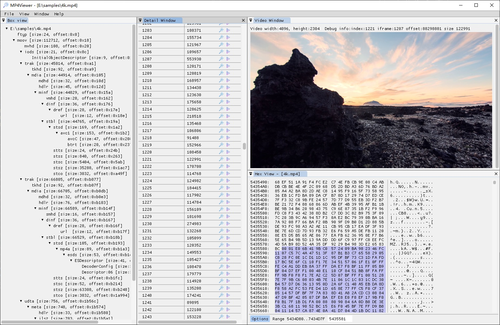
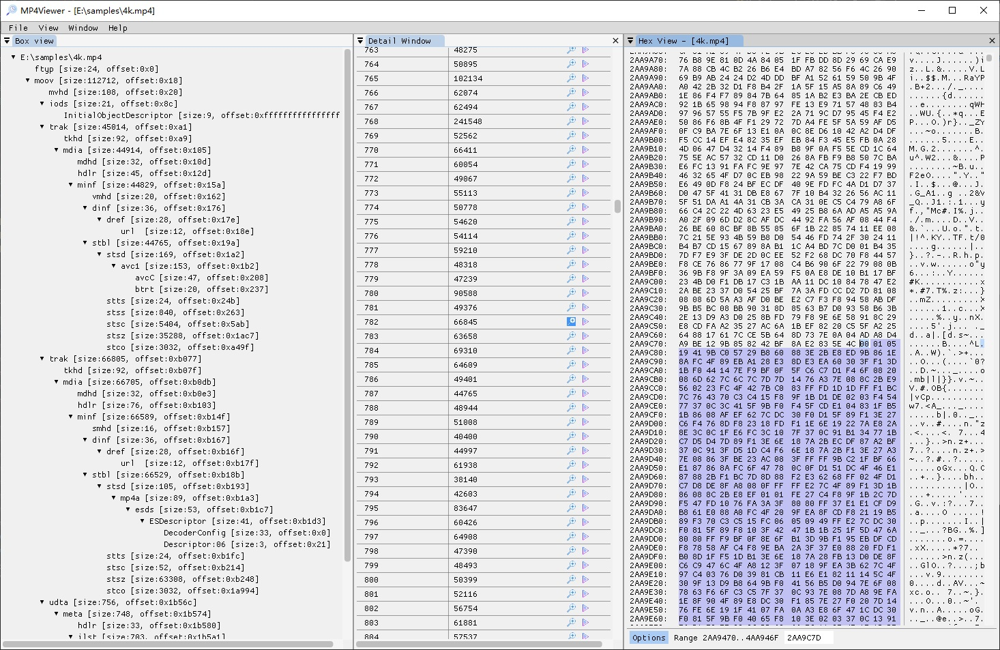

MP4Viewer
====

### About  
MP4Viewer is a mp4/mov GUI viewer/editor.  

### GUI
  
    
  

### Future plans
- multi-platform support
- 4k(high dpi) support

### External Libraries
This program uses the following external opensource project.  
- Bento4(https://github.com/axiomatic-systems/Bento4)
- ImGui(https://github.com/ocornut/imgui)
- imgui_club(https://github.com/ocornut/imgui_club)
- drag and drop file on Win32, thanks to johanwendin(https://github.com/ocornut/imgui/issues/2602)
- FFmpeg, integrate binary library from https://github.com/BtbN/FFmpeg-Builds

### License  
Distributed under the GPL License. See LICENSE for more information.  
